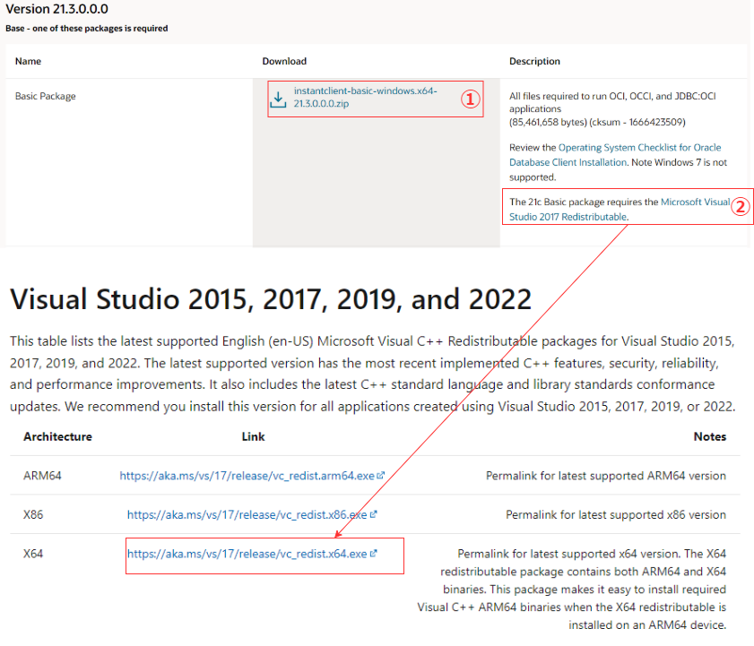
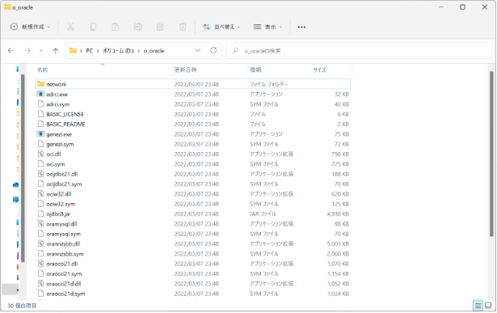
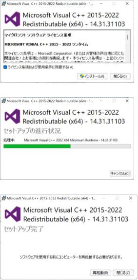

# （Draft) PythonでOracleDBへ接続

### Draft

* [ ] Oracle Client
  * [ ] 配置場所
  * [ ] TNS_ADMIN（tnsnames.ora）の格納場所

### 目的

* PythonでOracle（AWS RDS）へ接続し、Select文の結果を取得

### 用意/設定する環境

* Python package "cx-python" 
* Oracle Client 19c 
* AWS RDS

### Oracle Client インストール ~ 設定

##### 1. 以下のLINKから必要なパッケージ①、②をインストール。
  *  [https://www.oracle.com/jp/database/technologies/instant-client/winx64-64-downloads.html](https://www.oracle.com/jp/database/technologies/instant-client/winx64-64-downloads.html)

  * 

##### 2. ①は、「D:\oracle」へ設置。"1"でDLしたZIPに格納されていたファイルを全て格納。

  * 

##### 3. ②はインストールしたexeを実行すればOK。インストール後に再起動を実施。

  * 

##### 4. 環境変数の設定
  * Path
  * TNS_ADMIN

### Python code

Writing

* "CX_oracle"を使うには、事前いOracle Clientのセットアップをしておくことが必須

### AWS RDS

Writing

### 参考

[DL Site](https://www.oracle.com/database/technologies/instant-client/winx64-64-downloads.html)

[環境変数](https://onl.la/7bfQmsx)
