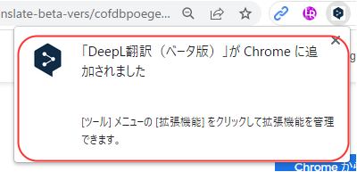

# DeepL Chrome 拡張機能（できること & 設定方法）

### 目次

1. できること
2. 設定方法

### 1. できること

* ブラウザ上の英文を ドラッグ -> DeepLアイコンクリック の操作で日本語へ翻訳可能
* 

### 2. 設定方法

Chromeがインストール済であることを前提とする。

1. Chromeを起動し次のLINKを開く。[DeepL翻訳 拡張機能](https://chrome.google.com/webstore/detail/deepl-translate-beta-vers/cofdbpoegempjloogbagkncekinflcnj?hl=ja)
2. LINK先の画面で⓵をクリック -> ⓶をクリック。
* 
3. 以下赤枠の画面が表示され、拡張機能が使えるようになる。
* 

