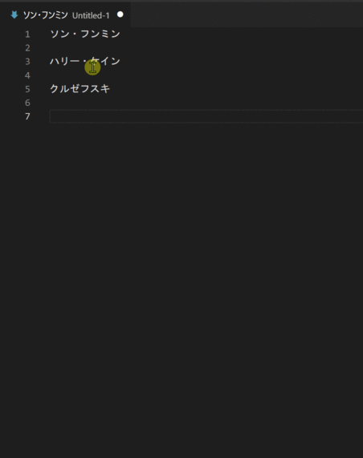
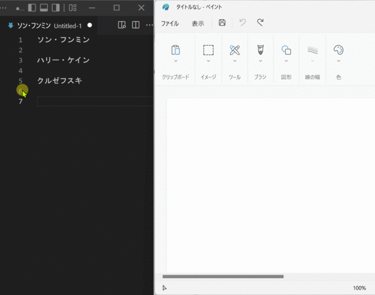
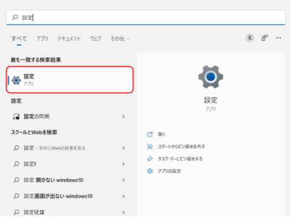
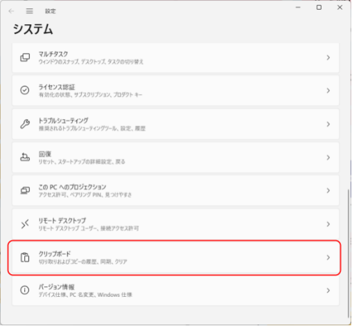
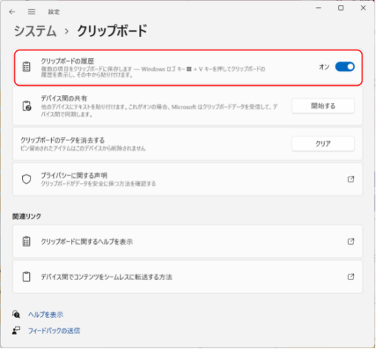

# Windows11 Clipboard 履歴（できること & 設定方法）

### 目次

1. できること
2. 設定方法

### 1. できること

* 「Ctrl + c」などでテキストや画像をコピーした後、貼り付ける際に「Windowsキー + v」を押すことでペースト対象をコピー履歴から選ぶことができる。

#### 1.1 文字の場合

* 操作手順
    1. 1行目コピー ▶ 3行目コピー ▶ 5行目コピー
    2. Windowsキー + v をクリック
    3. 3行目コピーしたテキストを選択して貼り付け
* 

#### 1.2 画像の場合

* 操作手順
    1. 「Windowsキー + Shift + s（選択範囲のキャプチャ取得）」の操作を3回実施
    2.  ペイントをアクティブにし、Windowsキー + v を押したのち、2回目に取得したキャプチャを選択
* 

### 2. 設定方法

Windows11であることを前提とする。

1. 「設定」を開く。
    * 

2. 「システム」画面が開くので、「クリップボード」をクリック。
    * 

3. 「クリップボード」画面が開くので、クリップボード履歴を"オン"にする。
    * 

