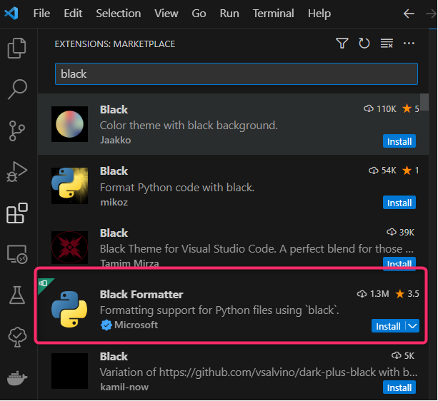
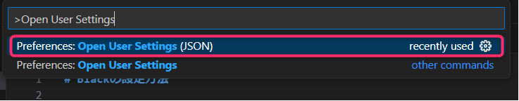
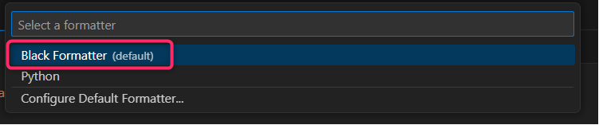

# VSCodeにPythonのフォーマッタであるBlackを適用させる方法

### 1. 概要
* PythonのコードフォーマッタであるBlackをVSCodeに適用させる方法を記載

### 2. 参考
1. [VSCode 公式](https://code.visualstudio.com/docs/python/formatting)
2. [Black 公式](https://black.readthedocs.io/en/stable/integrations/editors.html#visual-studio-code)

### 3. 前提
* VSCodeの拡張機能をDLする方式
* Pythonのバージョンは3.7以上が必要（2.参考-2のLINK先より）

### 4. 設定手順

1. Pythonのバージョンが3.7以上であることを確認
```cmd
# Windows OSでの確認コマンド
D:\>python --version
Python 3.8.10
```

2. 拡張機能 > 「Black」をインストール



1. VSCodeでsetting.jsonを開く
Ctrl + Shift + P -> Preferences Open User Settings (JSON) を選択。



1. VSCodeで「Black」をデフォルトに設定
手順３で開いたJsonファイルに以下を追記し、保存する。
```json
"[python]": {
    "editor.defaultFormatter": "ms-python.black-formatter"
},
```

1. 設定確認。適当なpythonファイル(.py)を作成し、VSCode上で開き、右クリック -> Format Document With をクリック。
Blackの横に(default)と書かれていることがわかる。



### 5.使い方
1. 対象のPythonファイルを開く > 右クリック > Format Document
2. 対象のPythonファイルを開く > Shift + Alt + F

### 6.フォーマッタ実行例


