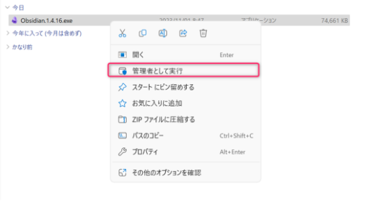

# WindowsにObsidianをインストールする方法

### 1. 概要
* Markdownファイルで動作する作成ソフトであるObsidianをWindows上でインストールする方法を記載

### 2. 参考
*  [Obsidian公式](https://help.obsidian.md/Getting+started/Download+and+install+Obsidian)

### 3. 前提
* 対象のOSはWinddows11

### 4. 設定手順

公式サイト記載の手順をなぞる。

1. [ダウンロードサイト](https://obsidian.md/download)にて、**Download for Windowsw**をクリック
    

1. ダウンロードしたインストーラを、**管理者として実行**を選択して起動
    

1. インストール完了後は、**日本語**を選択して**クイックスタート**にてアプリ起動
    
