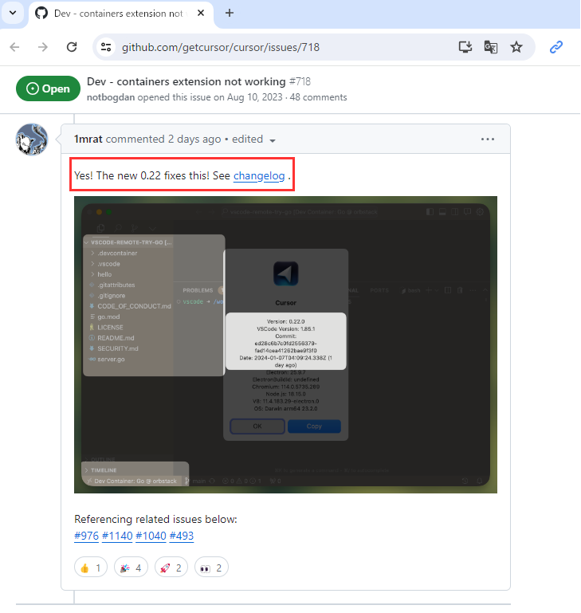
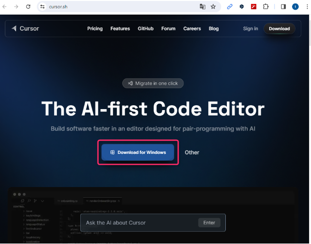
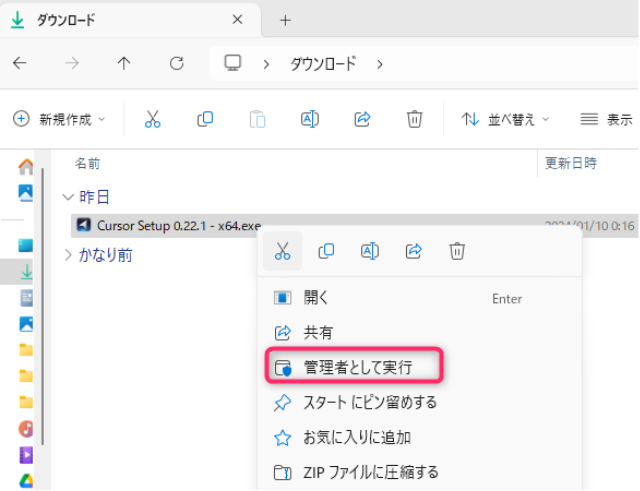
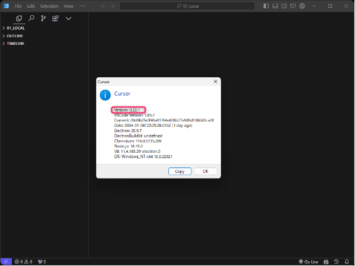
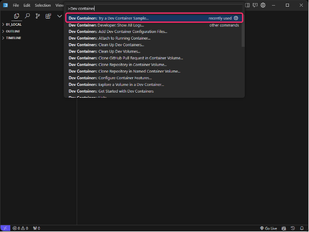
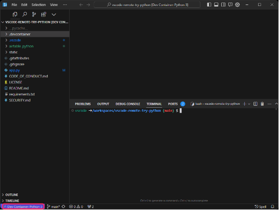

# CursorエディタでDevcontainerが使えるようになったので動作確認してみた

### 1. 概要
* AIエディタと言われる**Cursor**で、[Devcontainer](https://code.visualstudio.com/docs/devcontainers/containers)が使えるようになったので試す。

### 2. 経緯
* Cursorの該当Issueである[Dev - containers extension not working](https://github.com/getcursor/cursor/issues/718)を定期的にチェックしていた。
* 2days ago（2024/1/8）に対応完了し、Version 0.22 から起動するようになったコメントを発見したので試してみた。
    

### 3. 参考
* [該当Issue](https://help.obsidian.md/Getting+started/Download+and+install+Obsidian)
* [Cursor Official Install](https://cursor.sh/)

### 4. 前提
* 対象OS：Winddows 11
* Docker Desktop がインストール済かつ、起動されていること。

### 5. 起動までの手順

以下の手順を記載する。
Cursorエディタのインストール > Cursorのバージョン確認 > [Dev Container Try Python](https://github.com/microsoft/vscode-remote-try-python)の起動

1. [公式サイト](https://cursor.sh/)にて、**Download for Windows**をクリック。最新バージョンがDLされるはず。
    

2. ダウンロードしたインストーラを、**管理者として実行**を選択して起動する。
    

3. インストール完了後は、Cursorエディタを起動しバージョン確認。以下**About**をクリックする。
    

4. Version.**0.22.1**だったことが確認できた。
    

5. ここで`Dev Container Try Python`をCursorエディタ上で起動してみる。起動方法は`Ctrl + p`でコマンドパレットを起動し、**Dev container**と入力したら出てくる以下画像の赤枠をクリックする。
    
    

6. 5の操作で画面が再描画される後、画面の左下に**Dev Containe**rと記載されていることで使えるようになったことの確認が取れた。
    
