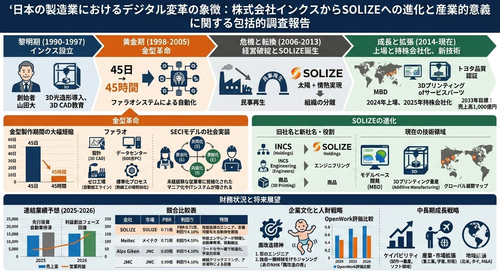

# SHIFT 解剖

### ■1. 読もうと思ったきっかけ

* 転職サイトに登録後「SHIFT」社からのオファー等を頂いて見知っていた。
* テスト工程に特化したポジションから始まっているのに興味を持った。エンジニアにとってテストはあまり面白くないもの。の認識がある。

### ■2. 印象に残った内容

* 丹下社長が日本のIT業界の構造（主に多重下請け）を変えたいという信念が。節々から伝わってきた。

### ■3. 気になった一文

> P.9）能力の発揮を阻む余計なものがあるとすれば、玉ねぎの皮を剥くように剥がしてしまえばいい。そうすればその人が持つ「コアな価値」が見えてくる。 

* 玉ねぎの皮を剝くように簡単にできる？とは思ってしまった。
 
> P.28）CAT検定、質問に回答するスピードや正確性 伝達能力何よりテスト業務に対する「素養」を判別している。　　　　　　　　　　　　　　　　　　　　　　　　　　　　　　　　　　　　　　　　　　　　　　　　　　　　　　　　　　　　　　　　　　

* CAT検定 … Computer Aided Test, 

> P.33）丹下社長は2000年にインクスに入社、その2年後にはインクスが持つノウハウを生かし「プロセステクノロジー」という考え方を編み出した。

* この一文からインクスという会社に興味を持った。

> P.55）丹下社長「自分たちはコンサルだからというだけの理由で自らをエリートと勘違いする人が何と多いことか。例えば子会社の社員と飲みに行こうとすると驚かれる。同じ仲間なのにヒエラルキーが存在することが嫌で仕方なかった。」

* こういう人がTopにいてほしい。多重下請け構造に問題意識を抱いている人だから、IT業界に新しい風を入れてくれると期待。

> P.86）エンジニアの場合、単価のおおむね6割程度が年収に反映される。

* わかりやすい指標。自分の単価が上がる=年収も上がるなので、新しい知識を得よういうモチベーションに繋がる。

> P.88）丹下社長「優秀なエンジニアと優秀なマネージャーが同じように評価される世界を作る。」 

* JTCの大半がやっていないことを実現しようとしている。がんばってほしい。

> P.120）丹下社長「意欲のない人に頑張れとは言わない。それは社員にとっても会社にとってもいい影響を与えない。ただトップガンを目指そうという雰囲気の情勢には力を入れる 」 

* トップガン … キャリアアップ精度

> P.206）社内アンケートやe-learningの平均回答時間を補足しており、回答にかかる時間が長い場合はアラートが出るようになっている。

* 「いつも回答が早い人が今回だけ遅かったら何か問題が起きている可能性がある。」という仮説から。

> P.216）丹下社長「データを集めるのは社員のパフォーマンスを伸ばすためそれ以外には全く興味がない。」 

* 私だったら粗さがしに使われるのではないか？と多少は思ってしまう。社長が上記を明言してくれているなら安心できる。

### ■4. LINK
* [Amazon](https://www.amazon.co.jp/SHIFT%E8%A7%A3%E5%89%96-%E7%A9%B6%E6%A5%B5%E3%81%AE%E4%BA%BA%E7%9A%84%E8%B3%87%E6%9C%AC%E7%B5%8C%E5%96%B6-%E9%A3%AF%E5%B1%B1%E8%BE%B0%E4%B9%8B%E4%BB%8B/dp/4296208535/ref=tmm_pap_swatch_0?_encoding=UTF8&dib_tag=se&dib=eyJ2IjoiMSJ9.mu0oKqf9D46i799V0DlDXg.lOcS-oRqCkUT4lBE_ew62dNi7ZqryYrGJNreU7L3K94&qid=1772927720&sr=1-1)

### ■5. Memo
* インクス社の概要
* 

### ■6. Task
* [ ] 自分の市場価値を棚卸する
  * 各種転職サービスの職務経歴書をアップデートする
    * [X] OpenWork
    * [ ] Linkedin